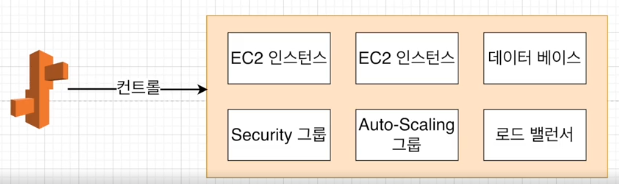

# 간단한 어플 실제 배포(테스트 & 배포부분)
### Travis CI
* 깃헙 레포지토리에 있는 프로젝트를 특정 이벤트에 따라 자동으로 테스트, 빌드하거나 배포 할 수 있다.
### 흐름
* 로컬git -> github -> Travis CI -> AWS
### AWS
* ElasticBeanStalk
  * 웹,앱 실행 및 관리
  * Apache, Nginx같은 서버에서 Java, PHP, Node.js, Pyhon, Ruby, Go 및 Docker와 함께 개발된 웹 응용 프로그램 및 서비스를 배포하고 확장하기 쉬운 서비스
  * EC2 인스턴스나 데이터베이스 같이 많은 것들을 포함한 '환경'을 구성하며 만들고 있는 소프트웨어를 업데이트 할 때마다 자동으로 이 환경을 관리해준다.
    